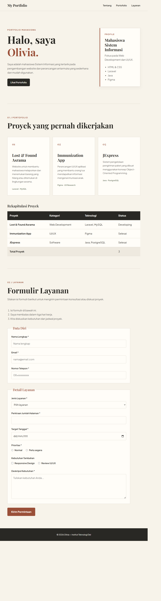

# Portofolio Web — Olivia Tambunan (12S24048)

Tugas Mandiri Minggu 3 — Mata Kuliah Pemrograman dan Pengujian Aplikasi Web (12S3101)
Program Studi S1 Sistem Informasi, Institut Teknologi Del
Dosen Pengampu: Chandro Pardede, S.Kom., M.Sc.

## Identitas Pengembang
| Atribut | Keterangan |
|---|---|
| Nama | Olivia Tambunan |
| NIM | 12S24048 |
| Kelas | 13 SI |
| Program Studi / Kelas | S1 Sistem Informasi |
| Institusi | Institut Teknologi Del |

## Live Demo
GitHub Pages: https://oliviatambunan1.github.io/ppw-2026-week2-12S24048/

## Ringkasan Pembaruan Minggu 3
Proyek portofolio dari Minggu 2 (HTML5 semantik + CSS3 murni) direfaktor total menggunakan
Bootstrap 5.3.3 yang dipadukan dengan Custom CSS Overrides, tanpa menghilangkan struktur
semantik HTML5 yang sudah dibangun sebelumnya. Pembaruan utama meliputi:

- Integrasi Bootstrap 5.3.3 CDN (CSS & JS Bundle) + Bootstrap Icons, dimuat sebelum style.css kustom.
- Responsive Navbar sticky-top dengan brand identity dan hamburger toggle (navbar-toggler + collapse).
- Hero Section dua kolom (Bootstrap Grid) dengan kartu profil dan dua tombol CTA.
- Grid Portofolio 12-kolom (row-cols-1 row-cols-md-2 row-cols-lg-3 g-4) berisi 4 kartu proyek,
  masing-masing terhubung ke Bootstrap Modal dengan konten detail berbeda.
- Formulir Layanan dimodernisasi dengan Floating Labels, Input Group berikon, select,
  radio, checkbox, serta umpan balik validasi visual (valid-feedback / invalid-feedback).
- CSS Custom Properties pada :root (11 variabel: warna, font, shadow, transisi) untuk tema
  personal yang konsisten, dipadukan dengan Advanced Selectors (>, ~, :hover, :focus-visible,
  :focus-within, :nth-child(), :is(), :not()) — tanpa satupun !important.

## Perbandingan: Sebelum vs Sesudah Integrasi Framework

| Aspek | Sebelum (Minggu 2 — CSS Murni) | Sesudah (Minggu 3 — Bootstrap 5) |
|---|---|---|
| CSS Framework | Tidak ada, seluruh gaya ditulis manual di style.css | Bootstrap 5.3.3 (CDN) + Bootstrap Icons, di-override dengan style.css kustom |
| Sistem Grid | CSS Grid manual (grid-template-columns) | Grid 12-kolom Bootstrap (row-cols-1 row-cols-md-2 row-cols-lg-3) |
| Navigasi | Nav statis tanpa menu mobile | Navbar sticky-top dengan hamburger toggle (navbar-toggler + collapse) responsif |
| Detail Proyek | Tidak ada tampilan detail, hanya kartu statis | Bootstrap Modal Dialog interaktif per proyek (4 modal berbeda) |
| Formulir | Input polos dengan label di atas input | Floating Labels (.form-floating), Input Group berikon, validasi visual valid/invalid-feedback |
| Ikon | Tidak ada ikon | Bootstrap Icons pada tombol, navbar, dan form |
| Variabel Tema | Warna ditulis langsung (hex berulang) | 11 CSS Custom Properties di :root (warna, font, shadow, transisi terpusat) |
| Selector CSS | Selector dasar (class & element) | Advanced selectors: combinator >  ~, :nth-child(), :focus-within, :is(), :not() |
| Responsivitas | 1 breakpoint (@media max-width: 768px) | Multi-breakpoint bawaan Bootstrap (sm, md, lg, xl) + custom media query |

## Teknologi
- HTML5 semantik (header, nav, main, section, article, aside, footer)
- Bootstrap 5.3.3 (CDN) + Bootstrap Icons 1.11.3
- CSS3 kustom: Custom Properties, Advanced Selectors, Flexbox, Grid, Media Queries
- Google Fonts: Playfair Display & Plus Jakarta Sans
- Git & GitHub Pages

## Struktur Proyek
ppw-2026-week2-12S24048/
├── index.html
├── style.css
├── screenshot/
│ └── desktop.png
└── README.md


## Screenshot


## Menjalankan Secara Lokal
```bash
git clone https://github.com/oliviatambunan1/ppw-2026-week2-12S24048.git
cd ppw-2026-week2-12S24048
git checkout week3-bootstrap
```
Buka index.html di browser, atau gunakan ekstensi Live Server di VS Code.

## Penulis
Olivia Tambunan (12S24048) — S1 Sistem Informasi, Institut Teknologi Del