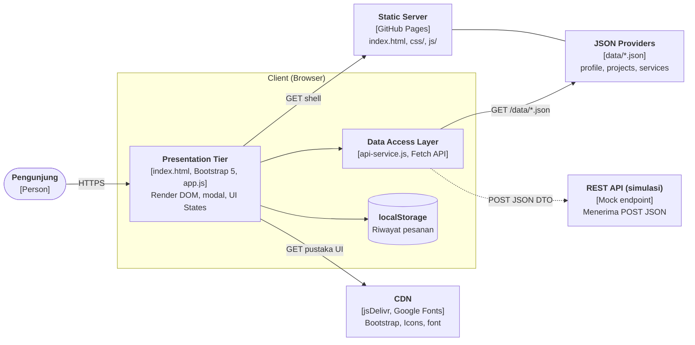
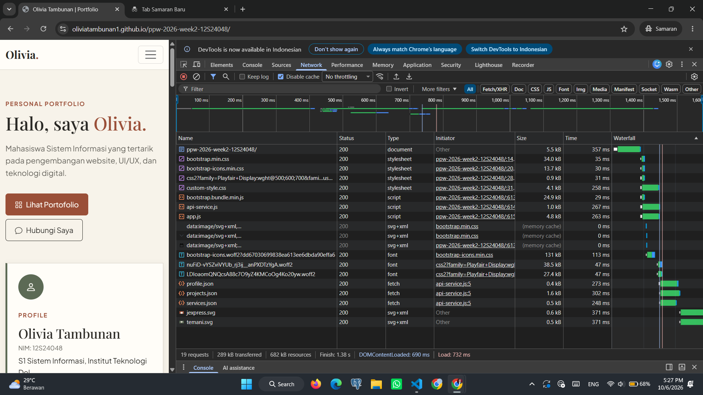
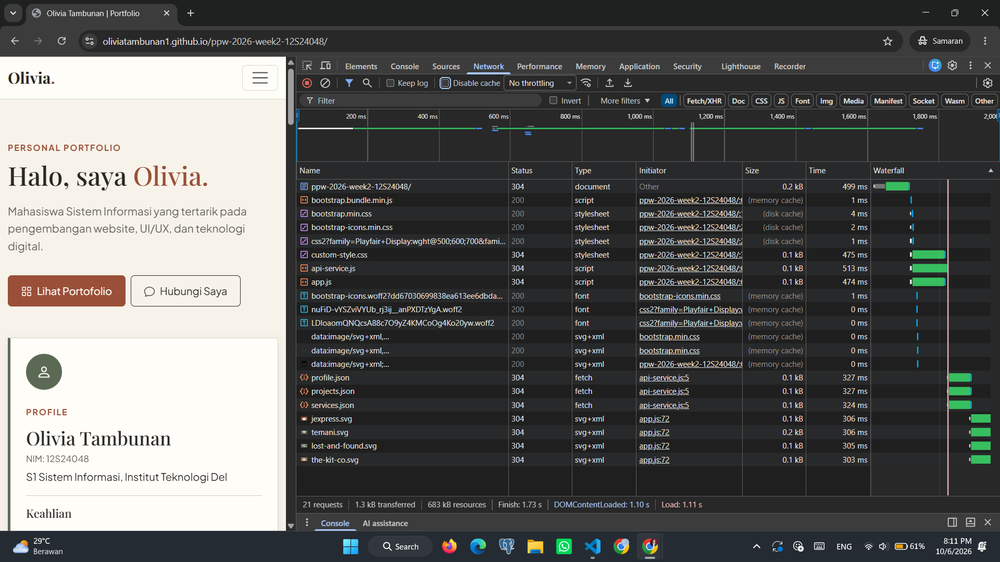

# Portofolio & Service Portal — Olivia Tambunan (12S24048)

Tugas Mandiri Minggu 4 — Pemrograman dan Pengujian Web (12S3101)
Refactoring Arsitektural: Decoupled Multi-Tier, Dynamic CSR, dan Network Performance Profiling

## Live Demo

GitHub Pages: https://oliviatambunan1.github.io/ppw-2026-week2-12S24048/

## 1. Diagram Arsitektur Sistem (C4 Container)



Garis putus-putus menandai alur yang disimulasikan: GitHub Pages hanya menyajikan berkas statis, sehingga
endpoint REST pada proyek ini berupa mock di `api-service.js`.

## 2. Narasi Separation of Concerns

Pada Minggu 3, seluruh konten (empat kartu proyek, empat modal, dan struktur formulir) ditulis langsung di
`index.html` sepanjang 857 baris. Pola monolitik statis ini membuat data dan tampilan menyatu: menambah satu
proyek berarti mengubah markup di beberapa tempat sekaligus (kartu, modal, tabel rekap).

Refactoring Minggu 4 memisahkan tiga kepentingan:

1. **Presentation Tier** (`index.html`, `custom-style.css`, `app.js`): `index.html` hanya berisi shell dan
   titik penampung konten; `app.js` merakit DOM dari data dan menangani event.
2. **Application/API Tier** (`api-service.js`): satu-satunya modul yang tahu lokasi dan format sumber data.
   `app.js` memanggil fungsi seperti `ApiService.getProjects()` tanpa peduli sumbernya JSON atau REST asli.
3. **Data Storage Tier** (`data/*.json` dan `localStorage`): data dapat diubah tanpa menyentuh kode.

Hasilnya, perubahan data cukup dilakukan di satu berkas, layer data dapat diuji terpisah dari DOM, dan sumber
data dapat diganti ke REST API sungguhan tanpa menulis ulang Presentation Tier. Konsekuensinya, halaman
bergantung pada JavaScript dan menampilkan data setelah satu request tambahan selesai.

## 3. Komparasi Paradigma Rendering

| Parameter          | Server-Side Rendering (SSR) | Client-Side Rendering (CSR)         | Jamstack / Decoupled Static     |
| ------------------ | --------------------------- | ----------------------------------- | ------------------------------- |
| Perakitan DOM      | Di server, per request      | Di browser via JavaScript           | Saat build-time dan hidrasi API |
| Beban server       | Tinggi                      | Sangat rendah (hanya transfer data) | Minimal (aset dari CDN)         |
| Time to First Byte | Menengah hingga lambat      | Sangat cepat (HTML shell mini)      | Sangat cepat (cache CDN)        |
| Interaktivitas     | Reload penuh tiap navigasi  | Mulus                               | Mulus dan reaktif               |
| Hosting            | Server runtime aktif 24/7   | Static CDN (GitHub Pages)           | Static CDN + serverless/API     |

Proyek ini memakai **CSR di atas static hosting**: shell dikirim sekali dari GitHub Pages, lalu JavaScript
mengambil JSON dan merakit DOM.

## 4. Tabel Komparasi Sebelum vs Sesudah Refactoring

| Aspek                  | Minggu 3 (Before)               | Minggu 4 (After)                           |
| ---------------------- | ------------------------------- | ------------------------------------------ |
| Struktur `index.html`  | 857 baris, konten hardcoded     | Shell HTML ~120 baris, konten diinjeksi JS |
| Data proyek            | 4 kartu statis di HTML          | `data/projects.json`, dirender dinamis     |
| Modal                  | 4 elemen modal terpisah di HTML | 1 universal modal, diisi via `data-id`     |
| Filter kategori        | Tidak ada                       | Filter dinamis, state Empty ditangani      |
| Pengiriman form        | Tidak ada                       | Fetch POST ke REST API + localStorage      |
| Penambahan proyek baru | Edit markup di 3 tempat         | Tambah 1 objek di `projects.json`          |
| Pemisahan kepentingan  | Tidak ada (monolitik)           | Presentation / DAL / Data Storage          |

## 5. Profil Jaringan (DevTools Network)

### Tabel Cold Load vs Warm Load

| Metrik            | Cold Load | Warm Load        |
| ----------------- | --------- | ---------------- |
| Total requests    | 19        | 21               |
| Data transferred  | 289 kB    | 1.3 kB           |
| Finish time       | 1.38 s    | 1.73 s           |
| TTFB (index.html) | 341.52 ms | 499 ms           |
| Status dominan    | 200 OK    | 304 Not Modified |

### Analisis

Pada **Cold Load** (cache dinonaktifkan), browser mengunduh seluruh aset dari server: HTML shell,
Bootstrap CSS/JS, Google Fonts, `custom-style.css`, `api-service.js`, `app.js`, dan tiga berkas JSON.
Total transfer mencapai 289 kB dengan TTFB 341.52 ms — waktu ini mencerminkan latensi GitHub Pages CDN
untuk pengunjung baru.

Pada **Warm Load** (cache aktif, reload biasa), browser mengirim request bersyarat ke server. Server
merespons **304 Not Modified** untuk `index.html`, `custom-style.css`, `api-service.js`, `app.js`, dan
seluruh berkas JSON — artinya tidak ada body yang dikirim ulang. Total transfer turun drastis menjadi
**1.3 kB** (hanya header respons). Aset Bootstrap dan font dilayani dari **memory cache** dan
**disk cache** sehingga durasinya 0–4 ms.

Status 304 membuktikan bahwa GitHub Pages mengirimkan header `ETag` dan `Cache-Control` yang benar pada
respons sebelumnya. Browser menyimpan salinan lokal dan hanya memvalidasi kesegaran konten, bukan
mengunduh ulang — inilah mekanisme HTTP caching yang membuat Warm Load hampir tidak membutuhkan bandwidth.

### Waterfall Cold Load



### Waterfall Warm Load



## Struktur Proyek

```
├── index.html
├── css/custom-style.css
├── data/
│   ├── profile.json
│   ├── projects.json
│   └── services.json
├── js/
│   ├── api-service.js
│   └── app.js
├── screenshot/
│   ├── waterfall-cold.png
│   └── waterfall-warm.png
└── README.md
```
